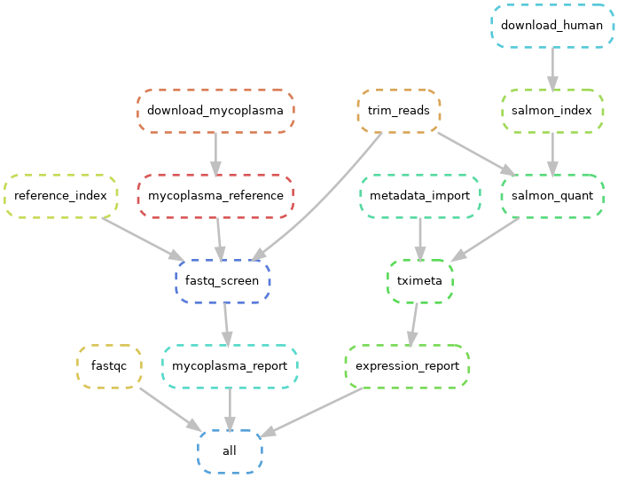

# organoids-probio
Comparisons of gut organoid transcriptomic responses to different probiotic strains

## Global considerations

The workplace needs to be setup within a conda environment for snakemake. 
This can be created by running 

conda env create -f envs/pymake.yaml

or 

conda create -n pymake -c bioconda -c conda-forge snakemake=5.7.0

Refer to the Snakefile file for the list of script to run and the dependenciesexi

## DAG of the global workflow 
<!---
snakemake --dag | dot -Tpng > dag.png
--->

