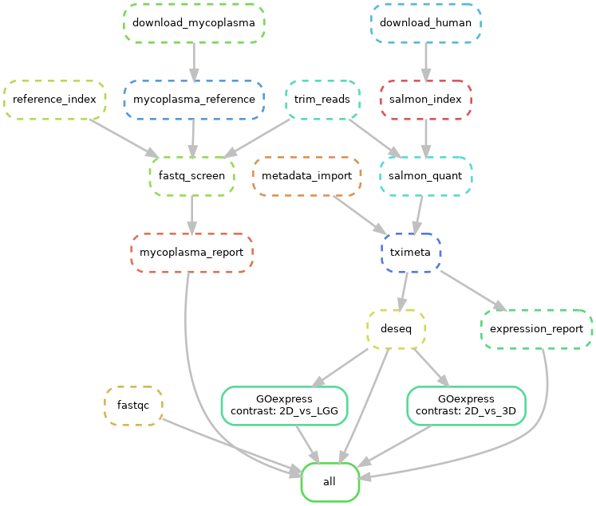

# organoids-probio
Comparisons of gut organoid transcriptomic responses to different probiotic strains

## Global considerations

The workplace needs to be setup within a conda environment for snakemake. 
This can be created by running 
```bash
conda env create -f envs/pymake.yaml
```
or 

```bash
conda create -n pymake -c bioconda -c conda-forge snakemake=5.7.0
```

Refer to the Snakefile file for the list of script to run and the dependencies

All scripts run from R version 3.5.0, as installed on Nyx (not Hestia).
We use packrat to keep track of all package versions.

We need to manually set the path to Pandoc to compile Rmd scripts from the workflow.
This is currently implemented via the .zshrc script.

## Directed Acyclic Graph of the global workflow 



Created using the command 
```bash
snakemake --dag | dot -Tpng > dag.png
```

